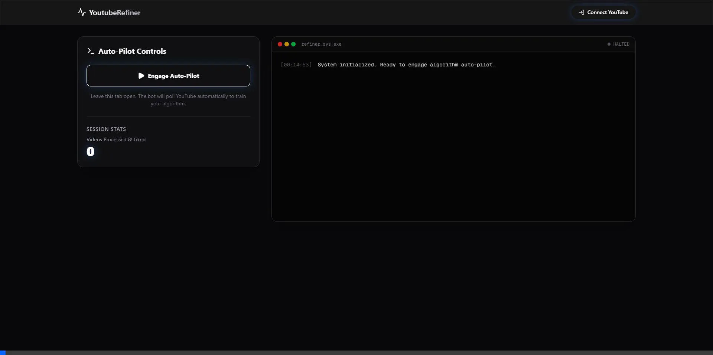

<div align="center">
  <h1>🚀 YouTube Algorithm Refiner (Auto-Pilot)</h1>
  <p><strong>Take back control of your YouTube feed using AI-driven positive reinforcement.</strong></p>
  <p>
    <a href="https://github.com/yourusername/youtube-refiner/blob/main/LICENSE">
      
    </a>
    <a href="https://nextjs.org/">
      
    </a>
    
  </p>
</div>

<div align="center">
  
</div>

## 🤔 The Problem
The YouTube algorithm is a zero-sum game of attention. It naturally drifts towards viral "slop", generic entertainment, and short-form dopamine loops because that is what statistically keeps the average user on the platform. If you want a feed heavily curated for deep technical topics, high-tier software engineering, and bleeding-edge AI concepts, you have to constantly, manually fight the algorithm.

## 💡 The Solution: AI Auto-Pilot
**YouTube Refiner** is an automated, background-tab console that programmatically force-trains your algorithm feed using **Overwhelming Positive Reinforcement**. 

Instead of manually clicking "Not Interested" (which the official API doesn't support anyway), this bot aggressively floods your account's history with highly targeted positive signals (Likes) on cutting-edge content, naturally suffocating generic viral videos and replacing your homepage with pure signal.

### 🧠 How the AI Engine Works
1. **Pulls Subscriptions:** Securely accesses your current YouTube subscriptions using OAuth 2.0.
2. **Aggregates State:** Randomly samples 5 of your trusted subscribed channels and fetches their absolute newest video releases via batched Quota-friendly loops.
3. **Gemini Synthesis:** Concatenates these trending topics and feeds them to **Google Gemini 2.5 Flash**, synthesizing a dynamic, hyper-relevant search query that represents your exact current niche.
4. **Programmatic Engagement:** Searches YouTube for brand new videos (under 30 days old) matching this generated query and automatically assigns a "Like" on your behalf.
5. **The Feedback Loop:** By executing this loop in a "Burst Mode" (every 30 seconds), your algorithm profile is rapidly and forcefully overwritten to prioritize your desired topics.

## 🛠 Tech Stack
- **Framework:** Next.js 15 (App Router) + React
- **Styling:** Tailwind CSS + Framer Motion (Premium Glassmorphism Hacker UI)
- **Auth:** NextAuth (Google OAuth 2.0 with YouTube Data API Scopes)
- **AI/LLM Engine:** Google Gen AI SDK (`gemma-3-27b-it`)
- **APIs:** Official Google APIs (`googleapis`)

---

## 🚀 Getting Started

### 1. Prerequisites
- Node.js 18+
- A Google Cloud Console project with the **YouTube Data API v3** enabled.
- Google OAuth 2.0 Client credentials.
- A free **Google Gemini API Key** (Google AI Studio).

### 2. Environment Variables
Clone the repo and create a `.env.local` file in the root directory. 

**👉 Read the [Complete SETUP.md Guide](SETUP.md) for step-by-step instructions on generating your free Google Cloud and Gemini API keys.**

```env
# OAuth Credentials
GOOGLE_CLIENT_ID="your_google_client_id_here"
GOOGLE_CLIENT_SECRET="your_google_client_secret_here"

# NextAuth Config
NEXTAUTH_URL="http://localhost:3000"
NEXTAUTH_SECRET="a_secure_random_string_like_a_super_secret_key"

# Gemini AI Key
GEMINI_API_KEY="your_gemini_api_key_here"
```

### 3. Installation & Run
```bash
npm install
npm run dev
```

Open [http://localhost:3000](http://localhost:3000), log in with your Google Account, and click **Engage Auto-Pilot**. Leave the tab open in the background while it executes the Burst Training!

---

## ⚠️ Important Note on API Quotas
Google limits the YouTube Data API to **10,000 Quota Units per day** for free tiers. The aggressive "Burst Mode" fetches data, synthesizes themes with AI, and searches for videos. This burns roughly 150 units per cycle. Do not run the bot 24/7 on Burst Mode, or you will immediately exhaust your quota!

## 📜 License
This project is licensed under the MIT License - see the [LICENSE](LICENSE) file for details.
